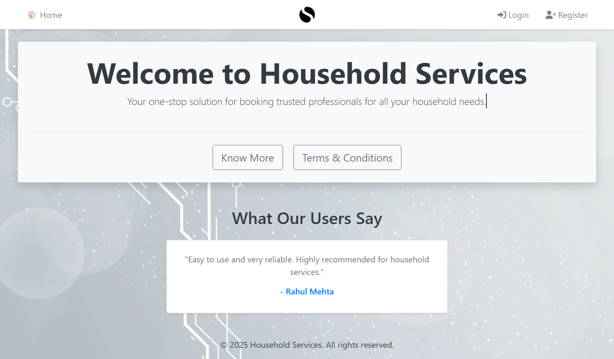
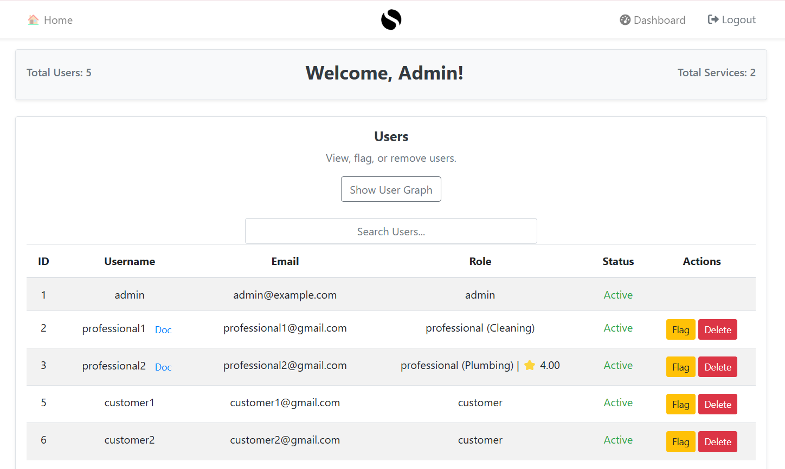
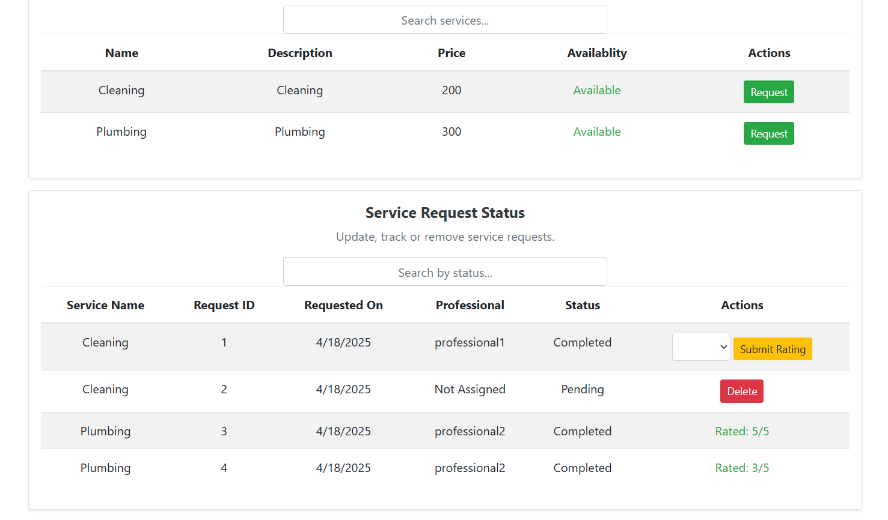
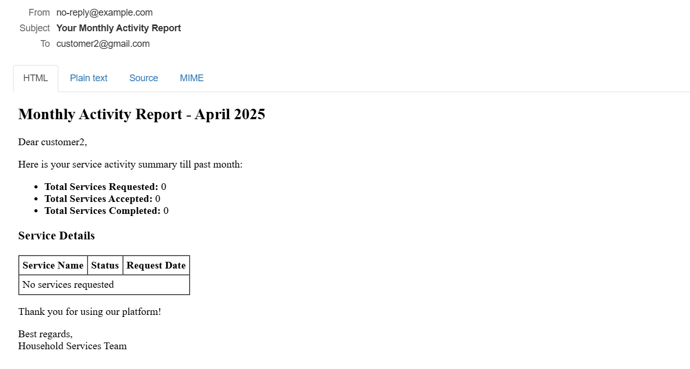

# Household Services App

This is a project for offering household services to the users and connecting them with professionals.

Created using Vue.js, Flask API, SQLlite for Database, Dashboard redirection using RBAC, Redis for caching, and Celery for backend jobs like emailing and exporting

